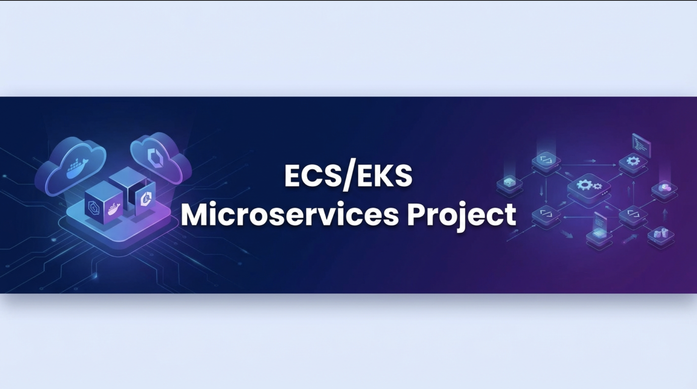
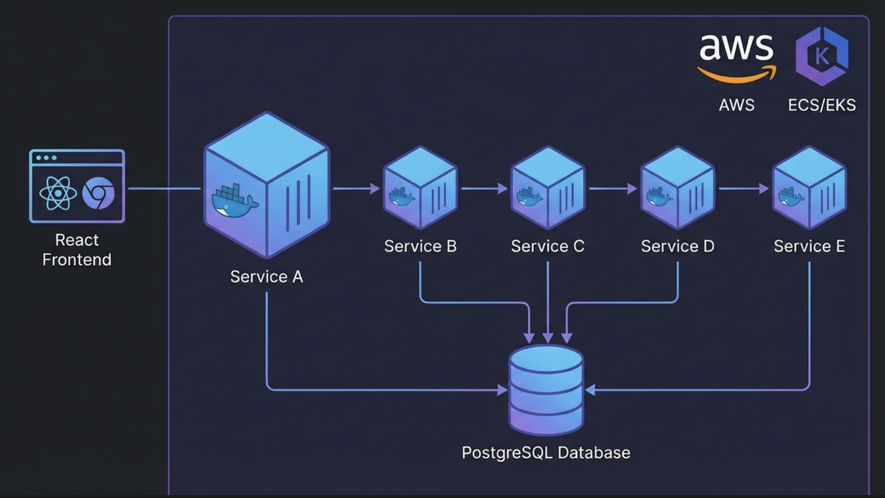
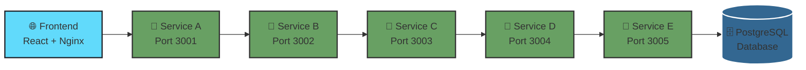

<div align="center">



# 🚀 ECS/EKS Microservices Project

### _Cloud-Native Microservices Architecture with Docker & AWS_

[](https://www.docker.com/)
[](https://aws.amazon.com/)
[](https://nodejs.org/)
[](https://reactjs.org/)
[](https://www.postgresql.org/)
[](https://expressjs.com/)

[Features](#-features) • [Architecture](#-architecture) • [Quick Start](#-quick-start) • [Deployment](#-deployment) • [Documentation](#-documentation)

</div>

---

## 📋 Overview

This project is a **production-ready microservices-based application** built with modern cloud-native technologies. It demonstrates a **sophisticated service-to-service call chain** with comprehensive health monitoring, database integration, and centralized logging.

### 🎯 Key Highlights

- **Frontend:** React SPA with Nginx (S3 + CloudFront ready)
- **Backend Services:** Service A → Service B → Service C → Service D → Service E
- **Database:** PostgreSQL with connection pooling
- **Containerization:** Multi-stage Docker builds for optimal image size
- **Orchestration:** Docker Compose (local) | AWS ECS/EKS (production)
- **Observability:** Winston logging, health checks, and monitoring endpoints

---

## ✨ Features

<table>
<tr>
<td width="50%">

### 🔐 **Production-Ready**
- Health check endpoints for all services
- Graceful shutdown handling
- Error boundary implementation
- Environment-based configuration

</td>
<td width="50%">

### 📊 **Observability**
- Centralized logging with Winston
- Request/response tracking
- Real-time status monitoring
- Service health dashboards

</td>
</tr>
<tr>
<td width="50%">

### 🐳 **Container Native**
- Optimized Docker images
- Multi-stage builds
- Docker Compose orchestration
- ECS/EKS deployment ready

</td>
<td width="50%">

### ☁️ **AWS Integration**
- ECR image repository
- ECS task definitions
- S3 + CloudFront hosting
- RDS PostgreSQL support

</td>
</tr>
</table>

---

## 🏗️ Architecture

<div align="center">



</div>

### Service Flow



### 📁 Project Structure

```
ECS_EKS/
├── 📦 docker-compose.yaml      # Local orchestration configuration
├── 🎨 frontend/                # React SPA frontend
│   ├── src/                    # React source code
│   ├── public/                 # Static assets
│   ├── dockerfile              # Multi-stage build
│   └── nginx.conf              # Nginx configuration
├── 🔷 serviceA/                # Entry point service
│   ├── app.js                  # Express application
│   ├── dockerfile              # Service container
│   └── package.json            # Dependencies
├── 🔷 serviceB/                # Processing service
├── 🔷 serviceC/                # Business logic service
├── 🔷 serviceD/                # Integration service
└── 🔷 serviceE/                # Data persistence service
```

### 🔄 Service Communication

| Service | Port | Endpoint | Health Check | Database |
|---------|------|----------|--------------|----------|
| **Frontend** | 3000 | `/` | N/A | ❌ |
| **Service A** | 3001 | `/serviceA` | `/health` | ✅ |
| **Service B** | 3002 | `/serviceB` | `/health` | ✅ |
| **Service C** | 3003 | `/serviceC` | `/health` | ✅ |
| **Service D** | 3004 | `/serviceD` | `/health` | ✅ |
| **Service E** | 3005 | `/serviceE` | `/health` | ✅ |

---

## 🚀 Quick Start

### Prerequisites

Ensure you have the following installed:

```bash
✓ Docker (v20.10+)
✓ Docker Compose (v2.0+)
✓ Node.js (v18+)
✓ AWS CLI (v2.0+)
✓ Git
```

### 🎬 Local Development

1️⃣ **Clone the repository**

```bash
git clone <repo-url>
cd ECS_EKS
```

2️⃣ **Configure environment variables**

Create `.env` files for each service:

**Backend Services (.env)**
```env
DB_HOST=postgres
DB_PORT=5432
DB_USER=postgres
DB_PASSWORD=postgres
DB_NAME=microservices
NEXT_SERVICE_URL=http://service-b:3002
```

**Frontend (.env)**
```env
REACT_APP_SERVICE_A_URL=http://localhost:3001
REACT_APP_SERVICE_B_URL=http://localhost:3002
REACT_APP_SERVICE_C_URL=http://localhost:3003
REACT_APP_SERVICE_D_URL=http://localhost:3004
REACT_APP_SERVICE_E_URL=http://localhost:3005
```

3️⃣ **Start all services**

```bash
docker-compose up --build
```

4️⃣ **Verify deployment**

```bash
# Check all containers are running
docker-compose ps

# Test health endpoints
curl http://localhost:3001/health
curl http://localhost:3002/health
curl http://localhost:3003/health
curl http://localhost:3004/health
curl http://localhost:3005/health
```

5️⃣ **Access the application**

| Service | URL | Description |
|---------|-----|-------------|
| 🌐 **Frontend** | http://localhost:3000 | React dashboard |
| 🔷 **Service A** | http://localhost:3001/serviceA | API endpoint |
| 🔷 **Service B** | http://localhost:3002/serviceB | API endpoint |
| 🔷 **Service C** | http://localhost:3003/serviceC | API endpoint |
| 🔷 **Service D** | http://localhost:3004/serviceD | API endpoint |
| 🔷 **Service E** | http://localhost:3005/serviceE | API endpoint |

---

## ☁️ Deployment

### 🐳 AWS ECS Deployment

#### Step 1: Build and Tag Docker Images

```bash
# Build images
docker build -t servicea:latest ./serviceA
docker build -t serviceb:latest ./serviceB
docker build -t servicec:latest ./serviceC
docker build -t serviced:latest ./serviceD
docker build -t servicee:latest ./serviceE
docker build -t frontend:latest ./frontend
```

#### Step 2: Push to Amazon ECR

```bash
# Authenticate with ECR
aws ecr get-login-password --region us-east-1 | \
  docker login --username AWS --password-stdin \
  <aws_account_id>.dkr.ecr.us-east-1.amazonaws.com

# Tag and push
docker tag servicea:latest <aws_account_id>.dkr.ecr.us-east-1.amazonaws.com/servicea:latest
docker push <aws_account_id>.dkr.ecr.us-east-1.amazonaws.com/servicea:latest

# Repeat for all services
```

#### Step 3: Create ECS Cluster

```bash
# Create cluster
aws ecs create-cluster --cluster-name microservices-cluster

# Verify cluster
aws ecs describe-clusters --clusters microservices-cluster
```

#### Step 4: Deploy Services

**Using AWS Console:**
1. Navigate to ECS → Task Definitions
2. Create task definition for each service
3. Configure container settings (image, port, environment)
4. Create ECS services with load balancing

**Using ECS CLI:**
```bash
ecs-cli compose --file docker-compose.yaml \
  --project-name microservices \
  service up \
  --cluster microservices-cluster \
  --launch-type FARGATE
```

---

### 🌐 Frontend Hosting (S3 + CloudFront)

#### Step 1: Build Production React App

```bash
cd frontend
npm install
npm run build
```

#### Step 2: Upload to S3

```bash
# Create S3 bucket
aws s3 mb s3://microservices-frontend

# Enable static website hosting
aws s3 website s3://microservices-frontend \
  --index-document index.html \
  --error-document index.html

# Upload build files
aws s3 sync build/ s3://microservices-frontend --delete

# Make public
aws s3 cp s3://microservices-frontend s3://microservices-frontend \
  --recursive --acl public-read
```

#### Step 3: Configure CloudFront

```bash
# Create CloudFront distribution
aws cloudfront create-distribution \
  --origin-domain-name microservices-frontend.s3.amazonaws.com \
  --default-root-object index.html
```

---

## 📊 Observability & Monitoring

### 📝 Logging

All backend services use **Winston** for structured logging:

```javascript
// Log format
{
  "timestamp": "2026-02-08T00:00:00.000Z",
  "level": "info",
  "message": "Request received",
  "service": "serviceA",
  "method": "GET",
  "path": "/serviceA",
  "correlationId": "uuid-v4"
}
```

### 🏥 Health Checks

Each service exposes a `/health` endpoint:

```bash
# Health check response
{
  "status": "healthy",
  "service": "serviceA",
  "timestamp": "2026-02-08T00:00:00.000Z",
  "uptime": 3600,
  "database": "connected"
}
```

### 📈 Monitoring Stack

- **CloudWatch**: Centralized logging and metrics
- **X-Ray**: Distributed tracing
- **ECS Service Metrics**: CPU, memory, network
- **Custom Metrics**: Request latency, error rates

---

## 🔧 Troubleshooting

### Common Issues

<details>
<summary><b>🔴 Connection Refused / ERR_CONNECTION_RESET</b></summary>

**Symptoms:**
- `ECONNREFUSED` errors
- `net::ERR_CONNECTION_RESET`

**Solutions:**
```bash
# Check if services are running
docker-compose ps

# Check logs
docker-compose logs serviceA

# Verify port mappings
docker port <container-name>

# Restart services
docker-compose restart
```
</details>

<details>
<summary><b>🔴 Database Connection Issues</b></summary>

**Symptoms:**
- "Cannot connect to PostgreSQL"
- Service health check fails

**Solutions:**
```bash
# Check PostgreSQL logs
docker-compose logs postgres

# Verify environment variables
docker-compose exec serviceA env | grep DB_

# Test database connection
docker-compose exec postgres psql -U postgres -d microservices
```
</details>

<details>
<summary><b>🔴 Frontend Cannot Reach Backend</b></summary>

**Symptoms:**
- API calls fail from browser
- CORS errors

**Solutions:**
```bash
# Check environment variables
cat frontend/.env

# Verify REACT_APP_ prefix
grep REACT_APP_ frontend/.env

# Rebuild frontend
docker-compose up --build frontend
```
</details>

---

## 📚 Documentation

### API Endpoints

#### Service A

```http
GET /serviceA
```

**Response:**
```json
{
  "message": "Response from Service A",
  "timestamp": "2026-02-08T00:00:00.000Z",
  "downstream": {
    "serviceB": "Response from Service B",
    "serviceC": "Response from Service C"
  }
}
```

#### Health Check

```http
GET /health
```

**Response:**
```json
{
  "status": "healthy",
  "service": "serviceA",
  "timestamp": "2026-02-08T00:00:00.000Z",
  "uptime": 3600,
  "database": "connected"
}
```

---

## 🛠️ Technology Stack

<div align="center">

| Category | Technologies |
|----------|-------------|
| **Frontend** | React, Nginx, HTML5, CSS3 |
| **Backend** | Node.js, Express.js, Winston |
| **Database** | PostgreSQL, pg (node-postgres) |
| **Containerization** | Docker, Docker Compose |
| **Cloud Infrastructure** | AWS ECS, AWS EKS, ECR |
| **Storage** | Amazon S3, CloudFront |
| **Monitoring** | CloudWatch, X-Ray |
| **CI/CD** | GitHub Actions (optional) |

</div>

---

## 🎓 Best Practices

- ✅ **Environment Variables**: All configuration through `.env` files
- ✅ **Health Checks**: Every service has `/health` endpoint
- ✅ **Graceful Shutdown**: Proper SIGTERM handling
- ✅ **Logging**: Structured logging with correlation IDs
- ✅ **Error Handling**: Comprehensive error boundaries
- ✅ **Security**: No secrets in code, IAM roles for AWS
- ✅ **Docker**: Multi-stage builds, minimal base images
- ✅ **Database**: Connection pooling, prepared statements

---

## 📝 Notes

> ⚠️ **Important Configuration Rules:**
> - All React environment variables **must** start with `REACT_APP_`
> - Backend services require `DB_*` and `NEXT_SERVICE_URL` variables
> - Update `.env` files before deployment to production
> - Never commit `.env` files to version control

> 💡 **Performance Tips:**
> - Use connection pooling for database connections
> - Implement caching where appropriate
> - Enable gzip compression in Nginx
> - Use CloudFront for global content delivery

---

## 🤝 Contributing

Contributions are welcome! Please follow these steps:

1. Fork the repository
2. Create a feature branch (`git checkout -b feature/AmazingFeature`)
3. Commit your changes (`git commit -m 'Add some AmazingFeature'`)
4. Push to the branch (`git push origin feature/AmazingFeature`)
5. Open a Pull Request

---

## 📄 License

This project is licensed under the **MIT License** - see the [LICENSE](LICENSE) file for details.

---

## 🙏 Acknowledgments

- AWS ECS/EKS documentation
- Docker and Node.js communities
- React and Express.js teams
- PostgreSQL contributors

---

<div align="center">

### 🌟 If you find this project useful, please consider giving it a star! 🌟


[](https://github.com/aliakbarkhan-DevOps/TRAFFIC_FLOW)
[](https://github.com/aliakbarkhan-DevOps/TRAFFIC_FLOW)


---

**[⬆ Back to Top](#-eceks-microservices-project)**

</div>